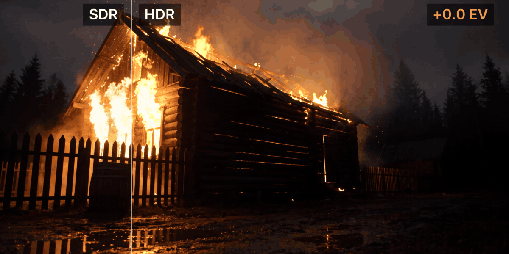
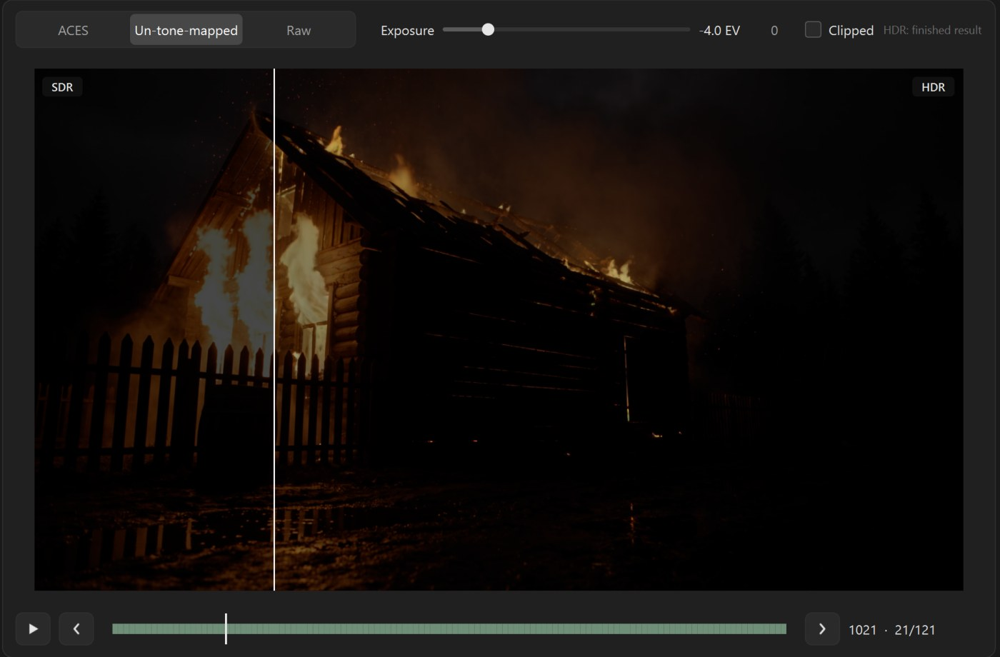

# HDR Converter

**Local SDR → HDR EXR conversion for AI-generated video. Native resolution up to 4K on a single 10 GB GPU.**

**[⬇ Download latest release](https://github.com/divnogorsky/hdr-converter/releases)** · [Install guide](docs/install.md) · [Requirements](docs/requirements.md)

*Same frame, same view transform, exposure pulled down to −6 EV and back. Left: SDR — the clipped highlights turn
into flat grey shapes. Right: HDR EXR — they keep their shape and colour.*

## Why

- **Runs locally.** Everything happens on your machine. Footage never leaves it — no cloud, no uploads.
- **Leaves the approved shot alone.** Outside the highlights the frame matches the source; resolution, fps, frame count
  and numbering stay exactly as they were. Only clipped and near-white highlights are rebuilt.
- **4K on one 10 GB GPU.** The full LTX-2.5 22B model; long or large shots are processed in overlapping chunks and
  stitched automatically, exposure-matched at the seams.
- **Drops into the pipeline.** ACEScg OpenEXR (16-bit half, ZIP) numbered from 1001, names taken from the source,
  a JSON with every parameter next to the frames.

## Status: beta

This is an early version. It works on the machines it was tested on, but expect rough edges, and check the results
before they go into a delivery. Bug reports are very welcome (see [Feedback](#feedback)).

## Requirements

Windows 10/11 64-bit, an NVIDIA GPU, and enough RAM and disk for the model — see
[docs/requirements.md](docs/requirements.md) (figures: TBD).

## Download and install

1. Download `HDRConverterSetup-<version>.exe` from [Releases](https://github.com/divnogorsky/hdr-converter/releases).
2. Check its sha256 and run it — step by step in [docs/install.md](docs/install.md), including what to do when
   Windows SmartScreen or an antivirus warns about a new, unsigned program.

The setup wizard checks your machine, finds or downloads the models and installs everything into one folder.
If you already have ComfyUI with the LTX models, it can reuse them without copying or changing anything.

## Models and licence

The models are downloaded from Hugging Face during installation; they are not part of this repository or the
installer. HDR Converter is built on **LTX-2.5** and the **SDR→HDR IC-LoRA** by [Lightricks](https://www.lightricks.com/).

The LTX-2.x models are under the
[LTX-2 Community License](https://github.com/Lightricks/LTX-2/blob/main/LICENSE-2_x): free for organisations with
annual revenue under $10M; above that a commercial licence from Lightricks is required. You accept it on the model
pages on Hugging Face before the download, and you are responsible for complying with it.

All third-party components and their licences: [THIRD_PARTY.md](THIRD_PARTY.md). The program's own licence:
[LICENSE.md](LICENSE.md).

## Feedback

- Bugs and questions: [Issues](https://github.com/divnogorsky/hdr-converter/issues) — the template asks for what
  helps to reproduce a problem.
- Contact: **@andrew_divnogorsky**

## Author

Andrew Divnogorsky
